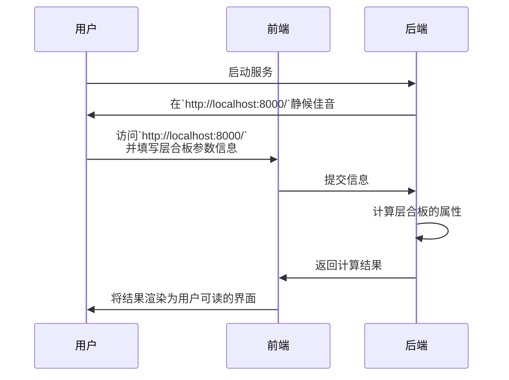
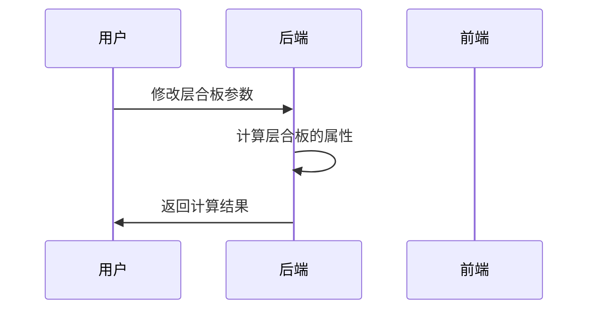

# 复合材料性能 辅助计算程序

> 求解层合板的柔度矩阵、刚度矩阵

项目地址：[GitHub](https://github.com/laorange/LaminateCalculation)  |  [Gitee](https://gitee.com/laorange/LaminateCalculation)

+ 前端使用: ts+vue3，
  + 组件库: [ElementPlus](https://element-plus.org), [NaiveUi](https://www.naiveui.com/), [VantUi ](https://vant-contrib.gitee.io/vant/#/zh-CN/home)三者都有用
  + 显示公式用的是 [Vatex](https://github.com/Shimada666/VaTex)
  + pinia, axios 等常用库
+ 后端使用: python，毕竟是科学计算，numpy 基本跑不了；Flask 开个简单的后端 ( Django 在此处就显得太笨重了...)

## 快速开始

视频介绍：[https://www.bilibili.com/video/BV1nv4y1A7N1](https://www.bilibili.com/video/BV1nv4y1A7N1)


## 运行流程




## 截图


----


----


## 可能出现的问题

### ⚠ 电脑名中包含中文名时不能正常启动后台

> 怎么解决？

> 参考：https://blog.51cto.com/u_15127683/3322904

#### 打开控制面板，点击“系统”


#### 打开“关于”


---

#### 其他方式

当然，如果因各种原因使电脑名称无法更改，您也可以直接修改 `backend/laminate.py` 中的参数来使用。



这是 `laminate.py` 的输出示例：

```javascript
{
    "A": [[145637162.58631513, 3515379.7865662277, 4.124438215584149e-10],
        [3515379.7865662277, 145637162.58631513, 7.890246342152453e-09],
        [4.1244382155841487e-10, 7.890246342152453e-09, 10000000.0]],
    "B": [[0.0, 0.0, 0.0],
        [0.0, -9.094947017729282e-13, 1.0097419586828951e-28],
        [0.0, 1.0097419586828951e-28, -2.2737367544323206e-13]],
    "C": [[82.4440259468508, 1.1717932621887424, 3.4370318463201245e-17],
        [1.1717932621887424, 14.647415777359281, 6.575205285127044e-16],
        [3.4370318463201245e-17, 6.575205285127044e-16, 3.3333333333333335]],
    "layers": [{
        "E_l": 140000000000.0,
        "E_t": 5000000000.0,
        "E_x": 140000000000.0,
        "E_y": 5000000000.0,
        "G_lt": 5000000000.0,
        "G_xy": 5000000000.0,
        "T": [[1.0, 0.0, -0.0], [0.0, 1.0, 0.0], [0.0, -0.0, 1.0]],
        "cos_theta": 1.0,
        "eta_xy": 0.0,
        "hat_E_l": 140615191462.64908,
        "hat_E_t": 5021971123.666039,
        "mu_xy": 0.0,
        "mu_yx": 0.012499999999999999,
        "nu_lt": 0.35,
        "nu_tl": 0.0125,
        "raideur_matrix_on_coordinate_L_T": [
            [140615191462.64908, 1757689893.2831135, 0.0],
            [1757689893.2831137, 5021971123.666039, 0.0],
            [0.0, 0.0, 5000000000.0]
        ],
        "raideur_matrix_on_coordinate_X_Y": [
            [140615191462.64908, 1757689893.2831135, 0.0],
            [1757689893.2831137, 5021971123.666039, 0.0],
            [0.0, 0.0, 5000000000.0]
        ],
        "sin_theta": 0.0,
        "souplesse_matrix_on_coordinate_L_T": [
            [7.142857142857143e-12, -2.5e-12, 0.0],
            [-2.5e-12, 2e-10, 0.0],
            [0.0, 0.0, 2e-10]
        ],
        "souplesse_matrix_on_coordinate_X_Y": [
            [7.142857142857143e-12, -2.5e-12, 0.0],
            [-2.5e-12, 2e-10, 0.0],
            [0.0, 0.0, 2e-10]
        ],
        "theta": 0.0
    },
        {
            "E_l": 140000000000.0,
            "E_t": 5000000000.0,
            "E_x": 5000000000.0,
            "E_y": 140000000000.0,
            "G_lt": 5000000000.0,
            "G_xy": 5000000000.0,
            "T": [
                [3.749399456654644e-33, 1.0, -1.2246467991473532e-16],
                [1.0, 3.749399456654644e-33, 1.2246467991473532e-16],
                [6.123233995736766e-17, -6.123233995736766e-17, -1.0]
            ],
            "cos_theta": 6.123233995736766e-17,
            "eta_xy": 6.276314845630185e-17,
            "hat_E_l": 140615191462.64908,
            "hat_E_t": 5021971123.666039,
            "mu_xy": -6.407527002681688e-17,
            "mu_yx": 0.35,
            "nu_lt": 0.35,
            "nu_tl": 0.0125,
            "raideur_matrix_on_coordinate_L_T": [
                [140615191462.64908, 1757689893.2831135, 0.0],
                [1757689893.2831137, 5021971123.666039, 0.0],
                [0.0, 0.0, 5000000000.0]
            ],
            "raideur_matrix_on_coordinate_X_Y": [
                [5021971123.666039, 1757689893.2831137, 4.1244382155841494e-07],
                [1757689893.2831135, 140615191462.64908, 7.890246342152452e-06],
                [4.124438215584149e-07, 7.890246342152452e-06, 5000000000.0]
            ],
            "sin_theta": 1.0,
            "souplesse_matrix_on_coordinate_L_T": [
                [7.142857142857143e-12, -2.5e-12, 0.0],
                [-2.5e-12, 2e-10, 0.0],
                [0.0, 0.0, 2e-10]
            ],
            "souplesse_matrix_on_coordinate_X_Y": [
                [2e-10, -2.5e-12, 1.255262969126037e-26],
                [-2.5e-12, 7.142857142857143e-12, -1.2815054005363377e-26],
                [1.255262969126037e-26, -1.2815054005363377e-26, 2e-10]
            ],
            "theta": 1.5707963267948966
        }
    ],
    "modules_apparents_matrix": [
        [1.3740764535817539e-11, -3.316736267266303e-13, 0.0],
        [-3.316736267266303e-13, 1.3740764535817539e-11, 0.0],
        [0.0, 0.0, 2e-10]
    ],
    "theta_list": [
        0.0,
        0.0,
        1.5707963267948966,
        1.5707963267948966,
        1.5707963267948966,
        1.5707963267948966,
        0.0,
        0.0
    ],
    "thickness_list": [
        0.00025,
        0.00025,
        0.00025,
        0.00025,
        0.00025,
        0.00025,
        0.00025,
        0.00025
    ],
    "total_thickness": 0.002
}
```

